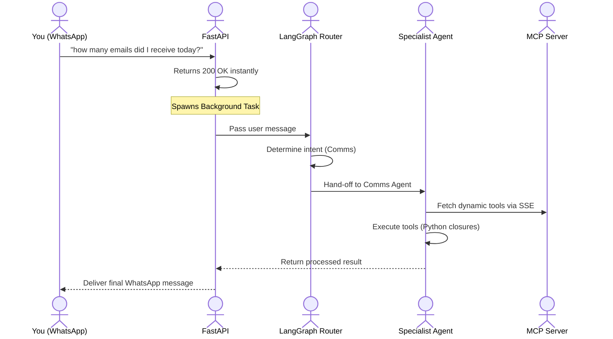

# AutoOps AI - Universal Automation Operating System

[](https://www.python.org/downloads/)
[](#)
[](#)
[](#)

**AutoOps AI** is an extensible, AI-powered automation operating system built on LangGraph. It acts as your personal AI fleet, accessible directly from your WhatsApp. By leveraging dynamic Model Context Protocol (MCP) tool servers and a modular specialist agent architecture, AutoOps routes your requests to the exact expert agent (Communications, DevOps, Finance, etc.) needed to execute the task securely and efficiently.

---

## Why AutoOps AI?

When building personal AI assistants, you often face limitations:
* **Tool Hallucinations:** Most LLMs fail at generating complex JSON arguments for tools, leading to API crashes.
* **Context Exhaustion:** Chat histories grow too large, causing LLMs to generate empty responses or crash out of token limits.
* **Rigid Monoliths:** Adding new capabilities (like querying a database or fetching emails) requires hardcoding new logic into a massive central prompt.

**AutoOps solves this through robust LangGraph orchestration and MCP.** 
The system intercepts WhatsApp webhooks, evaluates intent using a lightweight router LLM, and hands off execution to isolated specialist sub-graphs. 

---

## Key Features

* **WhatsApp Native Interface**: Communicate with your entire OS fleet from a single WhatsApp chat interface using Meta's Cloud API. 
* **Dynamic MCP Tool Servers**: Agents load their capabilities dynamically from local Model Context Protocol (MCP) servers, completely decoupling the AI logic from the tool implementations.
* **Robust Closure Tooling (Zero Hallucinations)**: The Comms Agent uses deterministic Python closures and secondary internal LLM text-parsers. This completely bypasses the standard (and highly error-prone) JSON tool-calling mechanism of LLMs, providing mathematical certainty for tasks like date math.
* **Memory & Vector Layer**: Integrated FAISS vector databases and SQLite checkpointers persist session context, allowing seamless follow-ups without overflowing token context windows.
* **Asynchronous Background Processing**: Webhook orchestration utilizes FastAPI `BackgroundTasks`. The server instantly returns `200 OK` to Meta to prevent retry loops while the heavy 100b+ parameter LLMs execute in the background.

---

## Architecture Flow



---

## Installation Guide

### Prerequisites
* Python 3.12+
* ngrok (for tunneling WhatsApp webhooks)
* A Meta Developer Account (for WhatsApp Cloud API)
* Google Cloud Console Project (for Gmail API credentials)
* Sarvam API Key (or OpenAI compatible LLM endpoint)

### 1. Clone & Install
```powershell
git clone https://github.com/Mubashir18305/AutoOps_Ai.git
cd AutoOps_Ai
python -m venv venv
venv\Scripts\activate
pip install -r requirements.txt
```

### 2. Environment Configuration
Create a `.env` file in the root directory:
```env
SARVAM_API_KEY=your_sarvam_api_key
WHATSAPP_TOKEN=your_meta_whatsapp_token
WHATSAPP_PHONE_ID=your_phone_number_id
```

### 3. Google OAuth Setup
Place your `credentials.json` from the Google Cloud Console in the root directory. Run the authenticator script to generate your local `token.json`.
```powershell
python auth_gmail.py
```

### 4. Running the OS

You need three terminal windows running simultaneously:

**Terminal 1: Ngrok Tunnel**
```powershell
ngrok http 8080
```
*(Copy the resulting HTTPS URL and update your WhatsApp Webhook configuration in the Meta Developer Portal)*

**Terminal 2: MCP Tool Server**
```powershell
venv\Scripts\activate
python -m src.mcp_server.comms_server
```

**Terminal 3: FastAPI Gateway**
```powershell
venv\Scripts\activate
python -m src.main
```

---

## The Specialist Fleet

AutoOps is designed to scale horizontally across multiple domains:

1. **Communications Agent (Active)**: Manages Gmail inbox, counts emails using deterministic PST-aware time parsers, and reads full email threads natively.
2. **Research Agent (Planned)**: Autonomous web scraper and document summarizer.
3. **DevOps Agent (Planned)**: GitHub and Jira integration for managing infrastructure and sprint tickets.
4. **Finance Agent (Planned)**: Stripe and invoice management.
5. **Healthcare Agent (Planned)**: FHIR and EHR querying.
6. **CRM Agent (Planned)**: HubSpot and Salesforce integration.

---

## Security & Privacy

* **Strict Local Execution**: The MCP servers and tool closures execute entirely on your local machine.
* **Encrypted Webhooks**: Communication between Meta and your OS runs entirely over secure ngrok HTTPS tunnels.
* **Isolated Tools**: The AI model never has direct access to raw HTTP requests; it only has access to the highly sandboxed MCP tools you expose.

---

