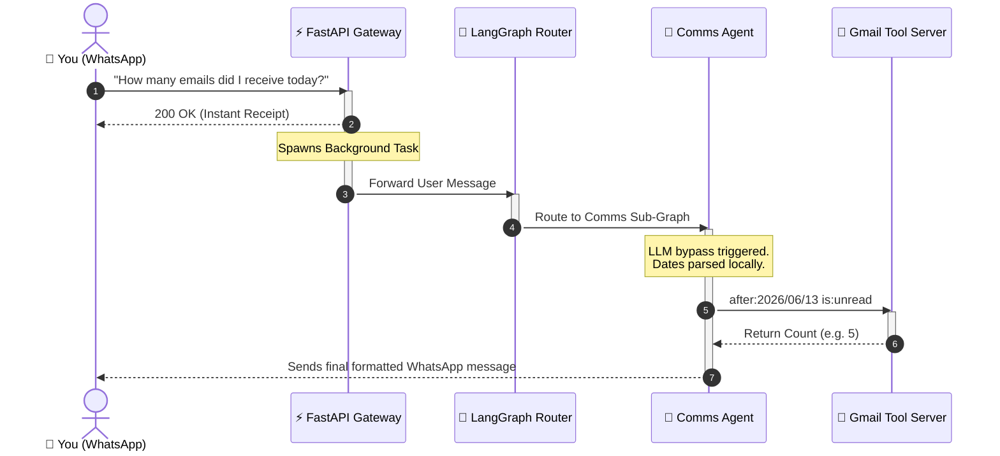

# AutoOps AI: Comms Agent

[](https://opensource.org/licenses/MIT)
[](https://www.python.org/downloads/)
[](#-installation-guide)
[](#)
[](#)
[](#)

**AutoOps AI** is your personal, highly intelligent Communications Assistant, accessible directly from your WhatsApp. By leveraging LangGraph and deterministic Model Context Protocol (MCP) tool servers, it securely manages your Gmail inbox—capable of reading, counting, and summarizing emails with zero hallucinations.

---

## Why AutoOps AI?

When building personal AI assistants with LLMs, you often hit limits:
* **Tool Hallucinations** cause LLMs to fail at generating complex JSON arguments for tools, leading to API crashes.
* **Context Exhaustion** happens when chat histories grow too large, causing LLMs to generate empty responses.
* **Timezone Quirks** cause agents to fail at interpreting relative dates like "yesterday" accurately against global APIs like Gmail.

**AutoOps solves this with deterministic Python closures and local orchestration.** The system intercepts WhatsApp webhooks, evaluates intent, and hands off execution to isolated sub-graphs that use mathematically certain local closures instead of error-prone LLM JSON parsing.

---

## Key Features

* **WhatsApp Native Interface**: You don't need to install a new app. Communicate with your AI directly through Meta's Cloud API on WhatsApp.
* **Robust Closure Tooling**: The Comms Agent uses inline Python closures to parse dates natively, bypassing standard JSON tool-calling to achieve mathematical certainty for relative time queries.
* **Async Background Execution**: Webhook orchestration utilizes FastAPI `BackgroundTasks`. The server instantly returns `200 OK` to Meta to prevent retry loops while the heavy LLMs execute asynchronously.
* **Dynamic MCP Tool Servers**: Tool capabilities are isolated in a local Model Context Protocol (MCP) server, decoupling AI logic from HTTP tool implementation.
* **100% Local Execution**: The tool closures execute entirely on your machine. Your private emails and inbox data are never routed through public web proxies.

---

## Security & Privacy

AutoOps is built with a local-first, privacy-respecting design:
* **Strict Local Tooling**: The Gmail API tools and closures execute exclusively on your local machine.
* **Encrypted Webhooks**: Communication between Meta and your OS runs entirely over secure ngrok HTTPS tunnels.
* **Isolated Capabilities**: The AI model never has direct access to raw HTTP requests; it only has access to the highly sandboxed tools you expose.
* **Git Control**: API keys and Google OAuth tokens are strictly ignored in `.gitignore`.

---

## AutoOps Flow in Action



---

## Installation Guide

### Prerequisites
* Python 3.12+
* ngrok (for tunneling WhatsApp webhooks)
* A Meta Developer Account (for WhatsApp Cloud API)
* Google Cloud Console Project (for Gmail API credentials)
* Sarvam API Key (or OpenAI compatible LLM endpoint)

### Windows / macOS / Linux Installation

1. **Clone the repository:**
   ```bash
   git clone https://github.com/Mubashir18305/AutoOps_Ai.git
   cd AutoOps_Ai/autoops
   ```

2. **Set up the virtual environment:**
   ```bash
   python -m venv venv
   source venv/bin/activate  # On Windows use: venv\Scripts\activate
   pip install -r requirements.txt
   ```

3. **Configure Environment Variables:**
   Create a `.env` file in the `autoops/` directory:
   ```env
   SARVAM_API_KEY=your_sarvam_api_key
   WHATSAPP_TOKEN=your_meta_whatsapp_token
   WHATSAPP_PHONE_ID=your_phone_number_id
   ```

4. **Authenticate Gmail:**
   Place your `credentials.json` from the Google Cloud Console in the `autoops/` directory and run:
   ```bash
   python auth_gmail.py
   ```

---

## Running the OS

You need three terminal windows running simultaneously from the `autoops/` directory:

### 1. Ngrok Tunnel
```bash
ngrok http 8080
```
*(Copy the resulting HTTPS URL and update your WhatsApp Webhook configuration in the Meta Developer Portal).*

### 2. Gmail Tool Server
```bash
venv\Scripts\activate
python -m src.mcp_server.comms_server
```

### 3. FastAPI Gateway
```bash
venv\Scripts\activate
python -m src.main
```

---

## AutoOps Folder Structure

```text
autoops/
├── .env              # Your API keys and tokens
├── credentials.json  # Google OAuth Client config
├── token.json        # Google OAuth User token
└── src/
    ├── agents/
    │   └── comms.py  # Core LangChain agent with Python closures
    ├── mcp_server/
    │   └── comms_server.py # Gmail API Tool Definitions
    ├── main.py       # FastAPI Gateway
    └── orchestrator.py # LangGraph routing logic
```

---
